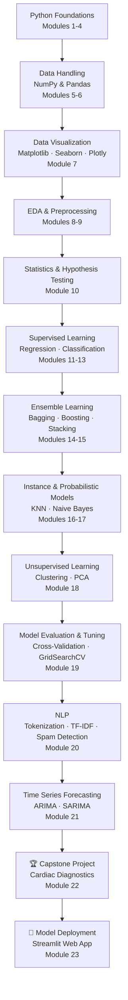

# 📊 Data Science with Python — TuteDude Course Portfolio

**End-to-end Data Science, Machine Learning, NLP & Deployment coursework** completed under the *TuteDude Data Science* program — covering Python fundamentals, statistics, EDA, 10+ ML algorithms, NLP, time-series forecasting, and model deployment with Streamlit.

<p align="left">
  
  
  
  
  
  
  
</p>

> 🔑 **Keywords:** Data Science Portfolio, Python for Data Science, Machine Learning Projects, EDA, Statistics, Linear & Logistic Regression, Decision Tree, Random Forest, Boosting, KNN, Naive Bayes, Clustering, NLP, Time Series Forecasting (ARIMA/SARIMA), Model Deployment, Streamlit, TuteDude Course

---

## 📌 Table of Contents

1. [Overview](#-overview)
2. [Course Completion Snapshot (KPIs)](#-course-completion-snapshot-kpis)
3. [Learning Path Diagram](#-learning-path-diagram)
4. [Repository Index](#-repository-index)
5. [Featured Project — Capstone](#-featured-project--capstone)
6. [Featured Project — Model Deployment](#-featured-project--model-deployment)
7. [Assignments](#-assignments)
8. [Tech Stack & Tools](#-tech-stack--tools)
9. [How to Use This Repository](#-how-to-use-this-repository)
10. [Key Skills Demonstrated](#-key-skills-demonstrated)
11. [About Me](#-about-me)

---

## 🧭 Overview

This repository documents my complete journey through the **TuteDude Data Science course**, from Python programming fundamentals to deploying a trained ML model as a web application. Every module below contains hands-on Jupyter notebooks, real-world case studies (healthcare, insurance, banking, retail, telecom), and the datasets used — organized so recruiters, mentors, and fellow learners can navigate straight to any topic.

## 📈 Course Completion Snapshot (KPIs)

| Metric | Count |
|---|---|
| 🗂️ Modules Completed | **23 / 23** |
| 📓 Jupyter Notebooks | **129+** |
| 🧮 Datasets Used (CSV/JSON/TXT) | **64+** |
| 📝 Assignments Submitted | **7** |
| 🤖 ML Algorithms Implemented | **12+** (Linear/Logistic Regression, Decision Tree, Random Forest, AdaBoost, Gradient Boosting, Stacking, KNN, Naive Bayes, K-Means, Hierarchical Clustering, PCA, ARIMA/SARIMA) |
| 🚀 Deployed Applications | **1** (Streamlit Diabetes Prediction App) |
| 🏆 Capstone Project | **1** (Cardiac Diagnostics / Heart Disease Prediction) |
| ✅ Course Status | **Completed** |

## 🗺️ Learning Path Diagram



## 📚 Repository Index

| # | Module | Core Concepts | Key Notebooks |
|---|---|---|---|
| 01 | [Introduction to Python](./Data_Science_TuteDude/1_Introduction%20to%20Python_Opearator_datatype) | Tokens, syntax, operators, data types | `1_Python program structure tokens.ipynb`, `2_python_operators_with_case_studies.ipynb` |
| 02 | [Conditional Statements & Loops](./Data_Science_TuteDude/2_Python_Conditional_statements) | if-else, while/for loops, break/continue | `3_if_conditional_statements.ipynb`, `4_loops_while_for_with_cases.ipynb` |
| 03 | [Python Data Structures](./Data_Science_TuteDude/3_Python%20Data%20Structure) | Lists, strings, tuples, dictionaries | `5A_List.ipynb`, `6_Tuple_Dictionaries.ipynb` |
| 04 | [Functions & Lambda](./Data_Science_TuteDude/4_Functions_Lamda_in_Python) | Functions, lambda, map, banking case study | `7_Functions_Lamda_map.ipynb` |
| 05 | [NumPy](./Data_Science_TuteDude/5_Numpy) | Arrays, numeric/text ops, insurance data case | `9_Numpy_Concept_Data analytics Insurance.ipynb` |
| 06 | [Pandas](./Data_Science_TuteDude/6_Pandas) | Series/DataFrames, missing data, groupby, patient records | `10_1_Pandas Concept series_df_csv.ipynb`, `10_3_Pandas_3_Case Study Patient Records.ipynb` |
| 07 | [Data Visualization](./Data_Science_TuteDude/7_Visualisation_matplot_seaborn_plotly) | Matplotlib, Seaborn, Plotly, used-car price analysis | `14_case_study_used_car_price_analysis_matplotlib_seaborn.ipynb`, `15_plotly.ipynb` |
| 08 | [Exploratory Data Analysis (EDA)](./Data_Science_TuteDude/8_EDA) | Missing values, normalization | `16_EDA_1_Missing_Normalization.ipynb`, `17_EDA2.ipynb` |
| 09 | [Data Preprocessing](./Data_Science_TuteDude/9_Data%20Preprocessing) | File handling (JSON/TSV/TXT), wrangling | `18_Data_Wrangling_File_Handling_Various_Formats.ipynb`, `19_Data_Preprocessing.ipynb` |
| 10 | [Statistics](./Data_Science_TuteDude/10_Statistics) | Descriptive stats, probability, hypothesis testing, Type I/II errors | `hypothesis_testing.ipynb`, `Probability.ipynb` |
| 11 | [Linear Regression](./Data_Science_TuteDude/11_Linear%20Regression) | Simple & Multiple Linear Regression, OLS, non-linear | `1_SLR_Footfall_sales_Sklearn.ipynb`, `LMR_case study_Loan Amout prediction.ipynb` |
| 12 | [Logistic Regression](./Data_Science_TuteDude/12_Logistic%20Regression%20ML%20model) | Binary classification — telecom churn, insurance claimants | `1_LogisticRegression_Telecom_churn.ipynb`, `2_Logistic Regression_claimants.ipynb` |
| 13 | [Decision Tree](./Data_Science_TuteDude/13_Decision%20Tree) | Tree-based classification, confusion matrix | `1 Dec_Tree_Car_Eval.ipynb`, `2 mushroom-classification-decision-tree-classifier.ipynb` |
| 14 | [Ensemble Learning — Bagging](./Data_Science_TuteDude/14_Ensemble%20Learning_Bagging) | Random Forest | `Random_Forest_Wine quality.ipynb` |
| 15 | [Boosting & Stacking](./Data_Science_TuteDude/15_Boosting_Stacking) | AdaBoost, Gradient Boosting, Stacking | `AdaBoost_wine_Quality.ipynb`, `Gradient_boost.ipynb`, `Stacking_wine.ipynb` |
| 16 | [K-Nearest Neighbors (KNN)](./Data_Science_TuteDude/16_KNN) | Classification, Pima Diabetes case study | `KNN_case_Pima Diabetics.ipynb` |
| 17 | [Naive Bayes](./Data_Science_TuteDude/17_Naive%20Bayes) | Probabilistic classification — Titanic survival | `NaiveBayes_Titanic.ipynb` |
| 18 | [Unsupervised Learning](./Data_Science_TuteDude/18_%20Unsupervised%20Learning) | K-Means, Hierarchical Clustering, PCA | `K-means.ipynb`, `Hirarchical_Clustering.ipynb`, `1_PCA_iris.ipynb` |
| 19 | [Model Evaluation & Tuning](./Data_Science_TuteDude/19_Model%20Evaluation%20%26%20Tuning) | Cross-validation, GridSearchCV | `Cross_Validation_GridSearchCV.ipynb`, `Model Evaluation.ipynb` |
| 20 | [Natural Language Processing (NLP)](./Data_Science_TuteDude/20_NLP) | Tokenization, stopwords, stemming/lemmatization, TF-IDF, spam detection, pharmacovigilance | `5_TF-IDF.ipynb`, `7_Case_study_Email check _Spam _NLP_NB.ipynb` |
| 21 | [Time Series Forecasting](./Data_Science_TuteDude/21_Time_Series_Forecasting) | Trend/seasonality, stationarity, ACF/PACF, ARIMA, SARIMA | `7_Arima.ipynb`, `SARIMA.ipynb`, `Best_ARIMA program.ipynb` |
| 22 | [🏆 Capstone Project](./Data_Science_TuteDude/22_Capstone_Project) | Cardiac diagnostics / heart disease prediction (full ML pipeline) | `Cardiac Diagnostics Case Study.ipynb`, `heart-disease-prediction-modern.ipynb` |
| 23 | [🚀 Model Deployment](./Data_Science_TuteDude/23_Model%20Deployment) | Streamlit web app, serialized model | `Deploying_Machine_Learning_model_using_Streamlit.ipynb`, `Diabetes Prediction web app.py` |
| — | [Assignments](./Data_Science_TuteDude/Assignments) | 7 graded assignments across Python, NumPy/Pandas, probability, KNN, Naive Bayes, time series | `Assignment1`–`Assignment7` |
| — | [Practice](./Data_Science_TuteDude/practice) | Extra self-practice notebooks reinforcing every module above | Mirrors topics from modules 5–21 |

## 🏆 Featured Project — Capstone

**Cardiac Diagnostics: Heart Disease Prediction**
`22_Capstone_Project/`

A complete ML pipeline — data cleaning, EDA, feature engineering, model training and evaluation — built to predict the likelihood of heart disease from patient clinical data (`heart.csv`). This project consolidates everything learned across statistics, preprocessing, classification algorithms, and model evaluation into one applied case study.

## 🚀 Featured Project — Model Deployment

**Diabetes Prediction Web App (Streamlit)**
`23_Model Deployment/`

A trained classification model (`trained_model.sav`) is wrapped in an interactive Streamlit application (`Diabetes Prediction web app.py`) that takes patient inputs and returns a real-time diabetes risk prediction — demonstrating the ML lifecycle from **notebook → serialized model → deployed app**.

## 📝 Assignments

| Assignment | Focus Area |
|---|---|
| Assignment 1 | Python fundamentals — Employee Management System (EMS) |
| Assignment 2 | NumPy, Pandas & Matplotlib exercises |
| Assignment 3 | Probability |
| Assignment 4 | KNN — Diabetes prediction |
| Assignment 5 | Naive Bayes — Titanic dataset |
| Assignment 6 | Time series — ARIMA on daily sales |
| Assignment 7 | (Reserved / in progress) |

## 🛠️ Tech Stack & Tools

| Category | Tools |
|---|---|
| Language | Python 3 |
| Environment | Jupyter Notebook |
| Data Handling | NumPy, Pandas |
| Visualization | Matplotlib, Seaborn, Plotly |
| Machine Learning | Scikit-learn |
| NLP | NLTK, spaCy |
| Time Series | Statsmodels (ARIMA/SARIMA) |
| Deployment | Streamlit |

## ⚙️ How to Use This Repository

```bash
# 1. Clone the repository
git clone https://github.com/rohi56/Data_Science.git
cd Data_Science/Data_Science_TuteDude

# 2. Create a virtual environment (recommended)
python -m venv venv
source venv/bin/activate      # On Windows: venv\Scripts\activate

# 3. Install common dependencies
pip install numpy pandas matplotlib seaborn plotly scikit-learn nltk spacy statsmodels streamlit jupyter

# 4. Launch Jupyter and explore any module
jupyter notebook
```

To run the deployed app:
```bash
cd "23_Model Deployment"
streamlit run "Diabetes Prediction web app.py"
```

## 🎯 Key Skills Demonstrated

`Python Programming` · `NumPy & Pandas` · `Data Visualization` · `Exploratory Data Analysis` · `Statistical Inference` · `Regression & Classification` · `Ensemble Methods` · `Unsupervised Learning` · `Hyperparameter Tuning` · `Natural Language Processing` · `Time Series Forecasting` · `Model Deployment (Streamlit)`

## 👤 About Me

**Rohit Ramteke** — transitioning from a DevOps/Siebel CRM background into AI/ML, with hands-on experience in data pipelines, predictive modeling, and NLP.

- 🔗 [LinkedIn](https://linkedin.com/in/rohi56)
- 🔗 [GitHub](https://github.com/rohi56)
- 🎓 [Credly Certifications](https://www.credly.com/users/rohi56)

---

⭐ *If you found this learning repository useful, consider giving it a star!*
